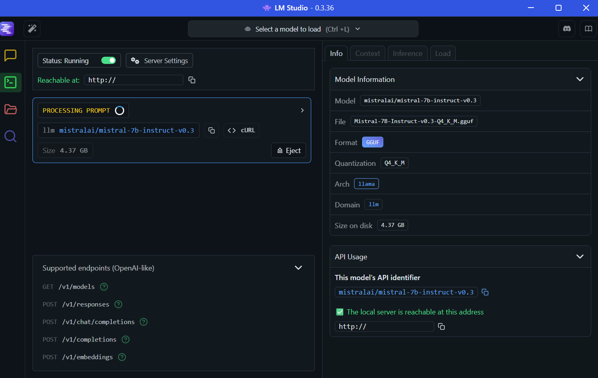
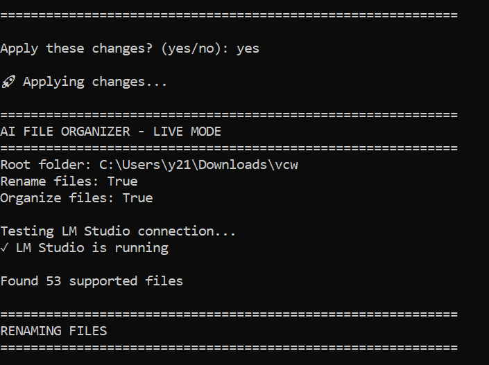

# 🤖 Offline AI File Organizer
> *I kept telling myself I'd organize my files "later." days passed. Thousands of cryptic filenames piled up. I checked and reviewed some apps on windows to rename and organize my files but non of them were good enough, So one day I realized: why force discipline when I can automate intelligence specially using local LLM? So I built this.*


**Transform your messy file system into an organized masterpiece using local AI.**

Automatically rename and organize your documents using AI that runs entirely on your machine. No cloud uploads, no privacy concerns, just intelligent file management powered by local LLMs.

<p align="center">
  
  
  
</p>

---

## ✨ Features

### 🎯 Intelligent Renaming
- **AI-Powered Analysis**: Reads actual file content to generate meaningful names
- **Smart Naming**: Transforms `8a095-4d0f6a90008b.pdf` → `My personal test on NY project (2025-03).pdf`
- **Date Integration**: Automatically adds modification date (YYYY-MM) to filenames
- **Duplicate Handling**: Safely manages duplicate names with incremental suffixes
- **Supports Two languages**: You can choose English or Persian as a language for analysis

### 📁 Smart Organization
- **Content-Based Categorization**: AI analyzes documents and sorts them into relevant folders
- **Predefined Categories**: Work, Personal, Finance, Medical, Education, Legal, Projects, Archive, Miscellaneous
- **Folder Structure Creation**: Automatically creates organized directory structure
- **Recursive Processing**: Handles nested folders and subdirectories

### 🔒 Privacy First
- **100% Offline**: All processing happens locally on your machine
- **No Cloud Upload**: Your sensitive documents never leave your computer
- **Local LLM**: Uses LM Studio with models like Mistral-7B-Instruct

### 🛡️ Safety Features
- **Dry Run Mode**: Preview all changes before applying them
- **Detailed Logging**: JSON log of all operations for easy reversal
- **Error Handling**: Gracefully handles corrupted or inaccessible files
- **Non-Destructive**: Original files are moved/renamed, never deleted

---

## 📋 Supported File Types

**Documents**: PDF, DOC, DOCX, TXT, MD, RTF, ODT  
**Spreadsheets**: CSV, XLSX, XLS  
**E-books**: EPUB

*Images, videos, and audio files are intentionally excluded to focus on document organization.*

---

## 🚀 Quick Start

### Prerequisites

1. **Python 3.7+** - [Download here](https://www.python.org/downloads/)
2. **LM Studio** - [Download here](https://lmstudio.ai/)
3. A local LLM model (e.g., Mistral-7B-Instruct)

### Installation

1. **Clone the repository**
   ```bash
   git clone https://github.com/yousefebrahimi0/ai-file-organizer.git
   cd ai-file-organizer
   ```

2. **Install dependencies**
   ```bash
   pip install -r requirements.txt
   ```


3. **Start LM Studio**
   - Open LM Studio
   - Load your preferred model (Mistral-7B-Instruct recommended)
   - Go to **Local Server** tab
   - Click **Start Server** (default port: 1234)



### Usage

1. **Run the script**
   ```bash
   python file_organizer.py
   ```

2. **Follow the prompts**
   - Enter the path to your messy folder
   - Choose operation mode:
     - `1` - Rename files only
     - `2` - Organize into folders only
     - `3` - Both rename and organize
   
3. **Review dry run**
   - Script shows what changes will be made
   - No files are modified yet

4. **Confirm changes**
   - Type `yes` to apply changes
   - Type `no` to cancel

---

## 📖 How It Works

```
┌─────────────────┐
│  Select Folder  │
└────────┬────────┘
         │
         ▼
┌─────────────────┐
│  Scan Files     │  (Recursive, all subdirectories)
└────────┬────────┘
         │
         ▼
┌─────────────────┐
│ Extract Content │  (PDF text, DOC content, CSV headers, etc.)
└────────┬────────┘
         │
         ▼
┌─────────────────┐
│  Send to AI     │  (Local LM Studio API)
└────────┬────────┘
         │
         ▼
┌─────────────────┐
│ Generate Names  │  (Descriptive + Date suffix)
│  & Categories   │
└────────┬────────┘
         │
         ▼
┌─────────────────┐
│  Dry Run View   │  (Preview all changes)
└────────┬────────┘
         │
         ▼
┌─────────────────┐
│ Apply Changes   │  (On user confirmation)
└─────────────────┘
```

---

## 🎯 Use Cases

### Personal Organization
- Sort years of accumulated personal documents
- Organize medical records, bills, and receipts
- Manage school/university papers

### Professional Workflow
- Organize project documentation
- Sort client files and contracts
- Manage research papers and references

### Digital Cleanup
- Clean up Downloads folder
- Organize scanned documents
- Sort archived files

---

## ⚙️ Configuration

### LM Studio Settings
The script connects to LM Studio at `http://localhost:1234` by default. To change:

```python
LM_STUDIO_URL = "http://localhost:YOUR_PORT/v1/chat/completions"
```

### Content Extraction Limits
Adjust how much content is sent to AI:

```python
MAX_CONTENT_LENGTH = 3000  # Characters to analyze
```

### Supported File Extensions
Modify the supported file types:

```python
SUPPORTED_EXTENSIONS = {
    '.pdf', '.doc', '.docx', '.txt', '.epub', 
    '.csv', '.xlsx', '.xls', '.rtf', '.odt', '.md'
}
```

---

## 📊 Example Output

### Before
```
Documents/
├── 8a095-4d0f6a90008b.pdf
├── scan_20231015_142033.pdf
├── IMG_9876.docx
├── untitled-final-v2.xlsx
└── document (3).txt
```

### After (Rename + Organize)
```
Documents/Organized/
├── Medical/
│   ├── Blood Test Results (2023-10).pdf
│   └── Vaccination Record (2023-08).pdf
├── Finance/
│   ├── Monthly Budget Tracker (2023-12).xlsx
│   └── Tax Documents 2023 (2024-01).pdf
└── Personal/
    ├── Travel Itinerary Europe (2023-09).docx
    └── Recipe Collection (2023-11).txt
```

---

## 🔧 Troubleshooting

### "Cannot connect to LM Studio"
- Ensure LM Studio is running
- Verify server is on port 1234
- Check firewall settings

### "Module not found" error
```bash
pip install --upgrade -r requirements.txt
```

### Slow processing
- Use a smaller/faster model
- Reduce `MAX_CONTENT_LENGTH`
- Increase API timeout in code

### Permission errors
- Run with administrator privileges (Windows)
- Check folder write permissions

---

## 🤝 Contributing

Contributions are welcome! Here's how you can help:

1. Fork the repository
2. Create a feature branch (`git checkout -b feature/AmazingFeature`)
3. Commit your changes (`git commit -m 'Add some AmazingFeature'`)
4. Push to the branch (`git push origin feature/AmazingFeature`)
5. Open a Pull Request

### Ideas for Contributions
- [ ] Support for more file formats
- [ ] Custom category templates
- [ ] GUI interface
- [ ] Undo functionality
- [ ] Other languages to support
- [ ] Integration with other local LLM frameworks

---

## 📝 License

This project is licensed under the MIT License - see the [LICENSE](LICENSE) file for details.

---

## 🙏 Acknowledgments

- **LM Studio** - For providing an excellent local LLM runtime
- **Mistral AI** - For the Mistral-7B-Instruct model
- All contributors and users of this project

---

## 📧 Contact

Have questions or suggestions? Open an issue or reach out!

---

<p align="center">Made for everyone tired of messy file systems</p>

<p align="center">
  <sub>⭐ Star this repo if it helped you organize your files!</sub>
</p>
